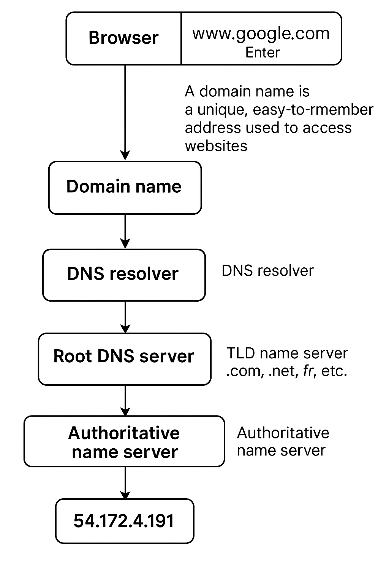

# What Happens When You Type google.com Then Press Enter.
Typing https://www.google.com into your browser and pressing Enter initiates an intriguing process, navigating through multiple layers of the web stack until the desired site appears on your display. Let's explore this journey, clarifying the complexities entailed.

## 1. The DNS(Domain Name System) server.
The first thing that happens when we type the URL www.google.com into our browser (such as Chrome, Firefox, Safari, etc.) and press "Enter" is that the browser begins to process, or parse, the URL. It identifies different components of the URL, and one of the first parts it looks at is the domain name — in this case, google.com. 

** But first, what is a domain name? **  
A domain name is a unique, human-readable address used to access websites, such as google.com or facebook.com. It acts as an easy-to-remember alias for an IP address, which is the actual numerical address of a website on the internet. 

If the browser doesn’t already know the IP address for the domain (i.e., it’s not cached locally), it will perform a DNS (Domain Name System) lookup to find the IP address associated with the domain name. 

This DNS request first goes to a DNS resolver, which is typically provided by your Internet Service Provider (ISP). If the resolver doesn’t have the IP address cached, it will ask a root DNS server. The root server doesn’t know the exact IP either, but it knows where to find the Top-Level Domain (TLD) name servers — in this case, for .com. Other TLDs include .net, .org, .fr, etc. 

The TLD server then directs the resolver to the Authoritative Name Servers for the domain. These are the servers that hold the actual DNS records for the domain name. There are usually multiple authoritative servers for redundancy and reliability. One of them will return the IP address associated with the domain — for example, 54.172.4.191. 

Finally, the resolver sends this IP address back to the browser, which then uses it to send a request to the appropriate web server — and the process of loading the website begins.

## 2. TCP/IP
** What is its significance? **  
TCP/IP (Transmission Control Protocol/Internet Protocol) creates a connection between your computer and the server of the domain name you are trying to reach.

After your computer obtains the IP address for www.google.com or the desired URL, **TCP** ensures the accurate and reliable delivery of data exchanged between your computer and Google's server. On the other hand, **IP** ensures that the data reaches the correct location.  

This process resembles an interaction where the browser sends a request to the server hosting the domain, and once the server receives it, it responds to confirm that a connection can be established.  

The server then sends back the requested URL (e.g., google.com) in the form of HTML code to the browser using TCP.

## 3. Firewall
To safeguard against hackers and attacks, servers frequently have a **firewall** installed. A firewall is a software program that establishes rules about what may enter or exit a network segment.

In our example, when the browser requests the website at the address 54.172.4.191, that request is examined by a firewall. The firewall determines whether the request is safe or if it poses a risk to the server’s security.  

Browsers can also be fitted with a firewall to check if the IP provided by the DNS request is potentially malicious.

## 4. HTTPS/SLL (Security & Encryption).
With the IP address acquired, the browser will handle the remaining segment of the URL, the https:// portion. HTTPS represents HyperText Transfer Protocol Secure and is a secured variant of standard HTTP. This transfer protocol outlines various kinds of requests and responses provided to clients and servers through a network. In other words, it’s the primary method for exchanging data between a browser and a site. HTTP and HTTPS requests encompass GET, POST, PUT, and additional methods. The requests and responses sent over HTTPS are encrypted, guaranteeing users that their data cannot be taken or misused by third parties. 
Another vital element in protecting websites is the SSL certificate. SSL refers to Secure Sockets Layer, which is also called TSL or Transport Layer Security. The certificate must be obtained from a reliable Certificate Authority, such as the well-known Let’s Encrypt, which offers free SSL certificates. When a site possesses this certificate, we can observe a small lock symbol next to the site name in the address bar. In certain browsers and with specific SSL certificate types, the bar appears green.

## 5. Load Balancer.
Websites reside on servers. For the majority of websites with substantial traffic, it would be unfeasible to be hosted on just one server. Additionally, it would establish a Single Point of Failure (SPOF), as a single attack on that server could bring the entire site offline.  
With increasing demands for greater availability and security, websites began enhancing their server counts, arranging them into clusters, and implementing load-balancers.  
A load-balancer is a software application that allocates network requests among multiple servers, adhering to a load-balancing algorithm. HAproxy is a well-known load balancer, and examples of algorithms we can utilize include round-robin, which evenly alternates requests among all servers, or least-connection, which allocates requests based on the current loads of servers. 
The load balancer acts like a receptionist, taking incoming requests and forwarding them to available servers for processing.

## 6. Web Server. 
** What is a Web Server? ** 
It’s a software program responsible for delivering web content to clients (usually browsers) in response to their requests.

Once your request reaches one of Google’s servers (via the load balancer), it is forwarded to a **web server**. The web server processes the request and returns resources such as HTML, CSS, and JavaScript — the essential components that form a webpage — back to your browser for rendering.

## 7. Application Server.
If the webpage requires more than just static content, the request is passed on to an **application server**.

An application server runs backend logic to handle requests, generate dynamic content, manage sessions, and perform calculations. This allows for interactive and personalized experiences such as account dashboards, recommendations, and more.

## 8. Database.
If the request needs information from a database, it is sent to a database server. The database server handles the storage, organization, and retrieval of data. This enables websites to deliver tailored content and retain user information. 

## 9. Conclusion
Visiting a website may appear straightforward, yet it entails a complex sequence of actions that occur in mere seconds — almost like magic.

Every step, from the DNS request to the final database query, is essential in ensuring a fast, secure, and functional experience. Understanding these underlying technologies helps us appreciate the power and sophistication behind something as simple as entering `google.com` in a browser.

